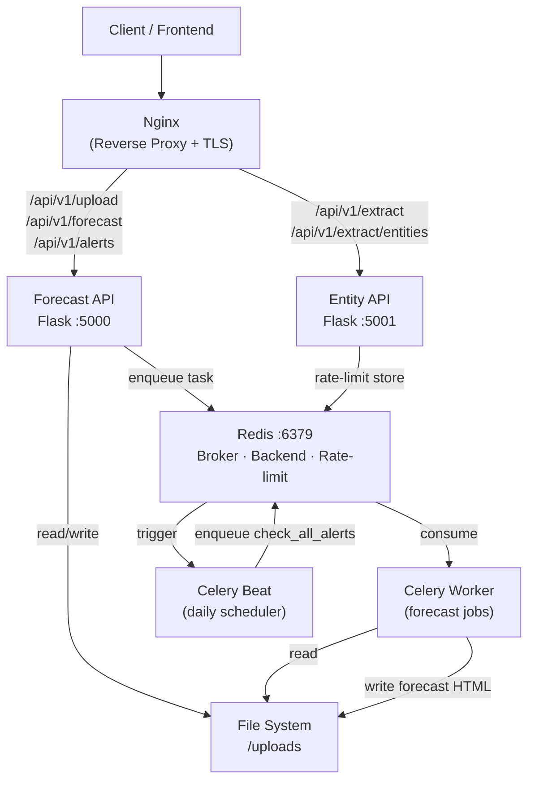
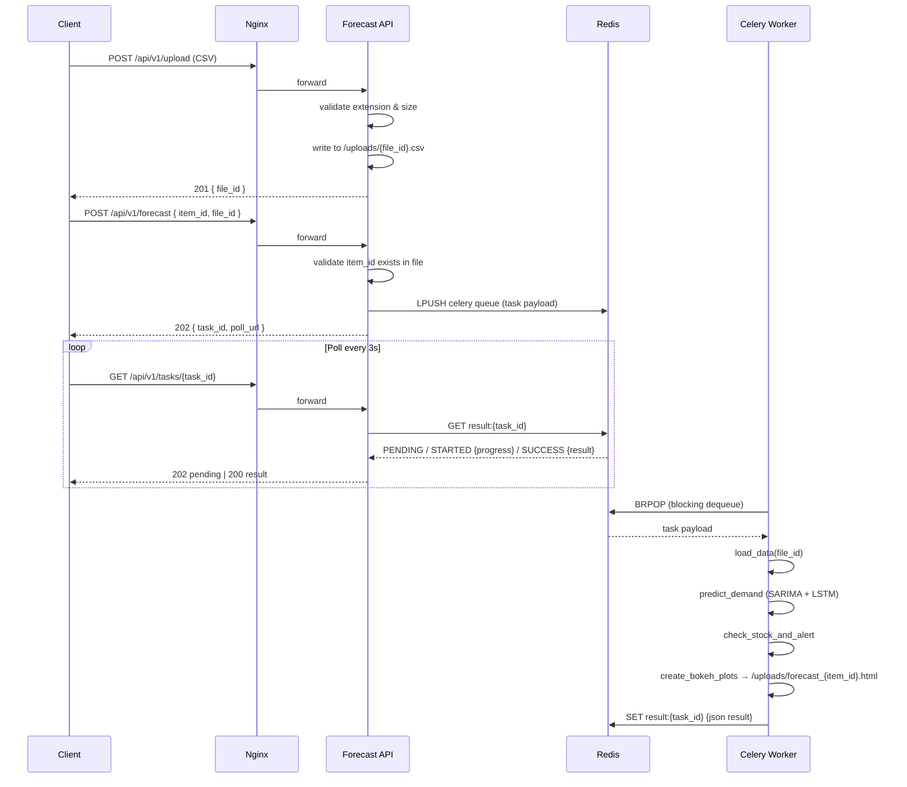
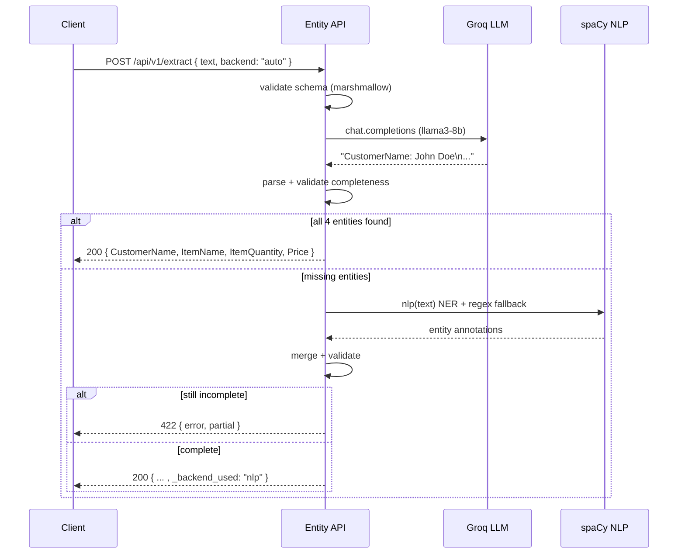
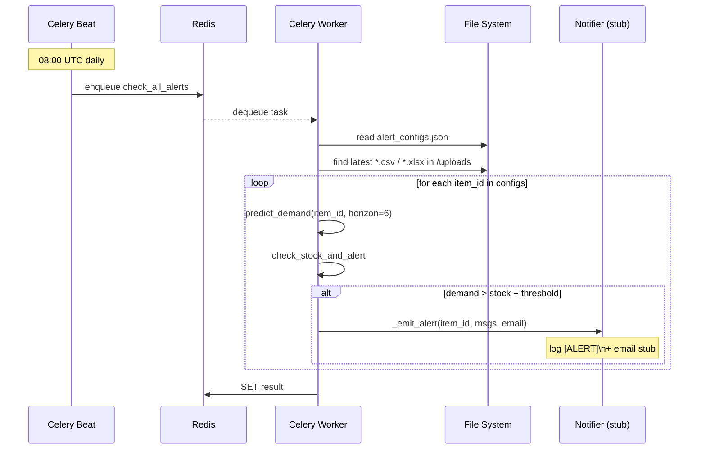
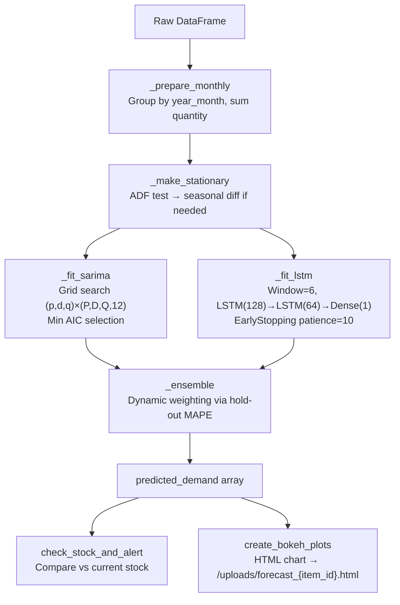
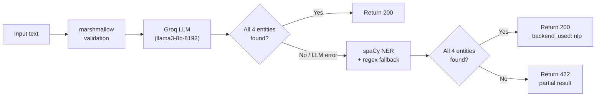
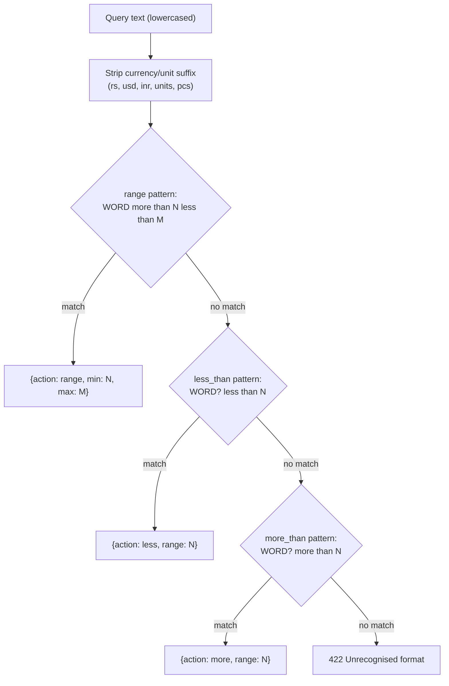

# Book-Keeping AI — Technical Documentation

## Contents

1. [System Architecture](#1-system-architecture)
2. [Data Flow Diagrams](#2-data-flow-diagrams)
3. [Forecasting Engine](#3-forecasting-engine)
4. [Entity Detection Engine](#4-entity-detection-engine)
5. [Scheduler & Alert System](#5-scheduler--alert-system)
6. [API Error Codes](#6-api-error-codes)
7. [Database / Storage Schema](#7-database--storage-schema)
8. [Security Model](#8-security-model)
9. [Extending the System](#9-extending-the-system)

---

## 1. System Architecture

### High-level component diagram



### Service responsibilities

| Service | Owns | Stateless? |
|---|---|---|
| `forecast-api` | HTTP interface, input validation, auth, file IDs | Yes (uploads on shared volume) |
| `entity-api` | HTTP interface, NLP/LLM extraction | Yes |
| `forecast-worker` | Model training + inference, plot generation | Yes |
| `forecast-beat` | Schedule definition, periodic task dispatch | No (needs `celerybeat-schedule` file) |
| `redis` | Task queue, result storage, rate-limit counters | No (persisted to volume) |

---

## 2. Data Flow Diagrams

### Upload + Forecast flow



### Entity extraction flow (auto backend)



### Scheduled alert flow



---

## 3. Forecasting Engine

### Model pipeline



### Ensemble weight calculation

The ensemble weight for SARIMA and LSTM is computed from their Mean Absolute Percentage Error on the last `horizon_months` of known data:

```
sarima_weight = lstm_mape  / (sarima_mape + lstm_mape)
lstm_weight   = sarima_mape / (sarima_mape + lstm_mape)
```

The model with **lower MAPE** receives a **higher weight**. If fewer than `horizon_months` samples exist, a fixed 60/40 (SARIMA/LSTM) split is used.

### Minimum data requirements

| Model | Minimum monthly observations |
|---|---|
| SARIMA | 4 (after stationarity transform) |
| LSTM | `WINDOW_SIZE + 4 = 10` |
| Ensemble | 10 (LSTM threshold is the binding constraint) |

If LSTM cannot run (insufficient data), the forecast falls back to SARIMA only.

---

## 4. Entity Detection Engine

### Extraction priority (auto backend)



### Entities extracted

| Field | Source (LLM) | Source (NLP) |
|---|---|---|
| `CustomerName` | `PERSON` entity in LLM response | spaCy `PERSON` label |
| `ItemName` | `ItemName` field from LLM | spaCy `PRODUCT` + regex `(\d+) (\w+) for` |
| `ItemQuantity` | `ItemQuantity` field from LLM | regex group 1, word-to-number normalised |
| `Price` | `Price` field from LLM | spaCy `MONEY` + regex `for \$?(\d+)` |

### Query entity grammar



---

## 5. Scheduler & Alert System

### Celery Beat schedule

| Task | Schedule | Configurable? |
|---|---|---|
| `check_all_alerts` (production) | Daily, 08:00 UTC | Change `crontab(hour=8, minute=0)` in `tasks.py` |
| `check_all_alerts` (development) | Hourly | Enabled when `ENV=development` |

### Alert config storage

Alert configurations are stored in `/uploads/alert_configs.json`:

```json
{
  "A001": {
    "low_stock_threshold": 20.0,
    "notify_email": "ops@company.com"
  },
  "B007": {
    "low_stock_threshold": 0.0,
    "notify_email": null
  }
}
```

**Production note:** For multi-worker deployments, migrate this to a Postgres table or Redis hash so all workers share the same config without file-locking issues.

### Integrating a real notification provider

Replace the `_emit_alert()` stub in `tasks.py`:

```python
# SendGrid example
def _emit_alert(item_id, alerts, email):
    from sendgrid import SendGridAPIClient
    from sendgrid.helpers.mail import Mail

    if not email:
        return
    message = Mail(
        from_email="alerts@yourcompany.com",
        to_emails=email,
        subject=f"Low stock alert — Item {item_id}",
        plain_text_content="\n".join(a["message"] for a in alerts),
    )
    SendGridAPIClient(os.environ["SENDGRID_API_KEY"]).send(message)
```

---

## 6. API Error Codes

| HTTP | Code | Meaning |
|---|---|---|
| 400 | `missing_file_id` | `file_id` not provided in forecast request |
| 401 | `unauthorized` | Missing or wrong `X-API-Key` header |
| 404 | `file_not_found` | `file_id` does not match any uploaded file |
| 415 | `unsupported_media` | File extension not `.csv` or `.xlsx` |
| 422 | `validation_error` | Request body failed marshmallow schema |
| 429 | `rate_limit` | Too many requests; includes `retry_after` |
| 500 | `internal_error` | Unhandled server error (check worker logs) |
| 202 | `queued` / `running` | Task still in progress; keep polling |

---

## 7. Database / Storage Schema

The current implementation uses the file system. The layout under `UPLOAD_FOLDER`:

```
/uploads/
  {file_id}.csv          ← uploaded dataset (CSV)
  {file_id}.xlsx         ← uploaded dataset (XLSX)
  forecast_{item_id}.html  ← Bokeh chart (generated by worker)
  alert_configs.json     ← alert configurations
  celerybeat-schedule    ← Celery Beat internal state
```

### Migrating to Postgres (recommended for production)

Add two tables:

```sql
CREATE TABLE uploads (
    file_id     TEXT PRIMARY KEY,
    filename    TEXT NOT NULL,
    path        TEXT NOT NULL,
    uploaded_at TIMESTAMPTZ DEFAULT NOW()
);

CREATE TABLE alert_configs (
    item_id              TEXT PRIMARY KEY,
    low_stock_threshold  NUMERIC NOT NULL DEFAULT 0,
    notify_email         TEXT,
    updated_at           TIMESTAMPTZ DEFAULT NOW()
);
```

---

## 8. Security Model

### Current

- **API Key**: `X-API-Key` header checked on every endpoint. Key set via `API_KEY` env var.
- **Rate limiting**: per-IP limits backed by Redis. Default: 200/day, 50/hour globally; tighter limits on write endpoints.
- **Input sanitisation**: `sanitize_item_id()` strips path-traversal characters. marshmallow validates all request bodies.
- **File validation**: extension whitelist + max size enforced before writing to disk.
- **Non-root container**: all services run as UID 1000.

### Recommended additions for production

- Replace shared API key with **JWT** (short-lived tokens, per-user identity).
- Add **request signing** for webhook callbacks from the Celery worker.
- Enable **Redis AUTH** (`requirepass` in redis.conf).
- Store secrets in **HashiCorp Vault** or **AWS Secrets Manager**, not `.env` files.

---

## 9. Extending the System

### Add a new forecasting model

1. Implement a function in `forecasting.py`:
   ```python
   def _fit_prophet(series, horizon) -> np.ndarray | None:
       ...
   ```
2. Call it alongside SARIMA and LSTM in `predict_demand()`.
3. Include its MAPE in `_ensemble()` and extend the weight calculation to N models.

### Add a new entity type

1. Add the field to the marshmallow schema in `entity_detection/app.py`.
2. Add a regex/NER extractor in `_extract_with_nlp()`.
3. Add a prompt instruction in `_extract_with_llm()`.
4. Update `_is_complete()` to check the new field.

### Add a new notification channel (e.g. Slack)

Replace or extend `_emit_alert()` in `tasks.py`:

```python
def _emit_alert(item_id, alerts, email):
    _slack_alert(item_id, alerts)
    if email:
        _email_alert(item_id, alerts, email)

def _slack_alert(item_id, alerts):
    import httpx
    webhook = os.getenv("SLACK_WEBHOOK_URL")
    if not webhook:
        return
    text = "\n".join(f"• {a['message']}" for a in alerts if a["level"] == "warning")
    httpx.post(webhook, json={"text": f"*Stock alert — {item_id}*\n{text}"})
```