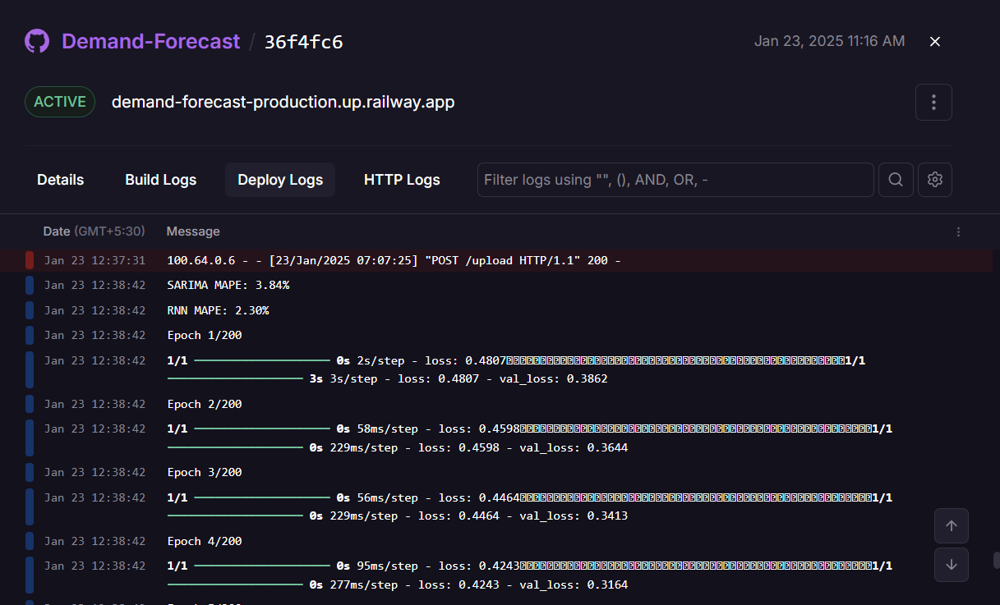
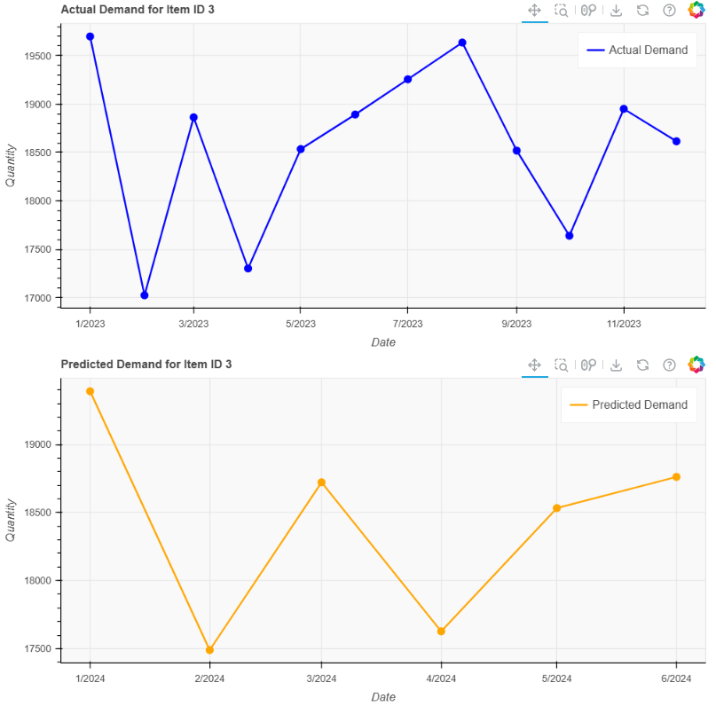
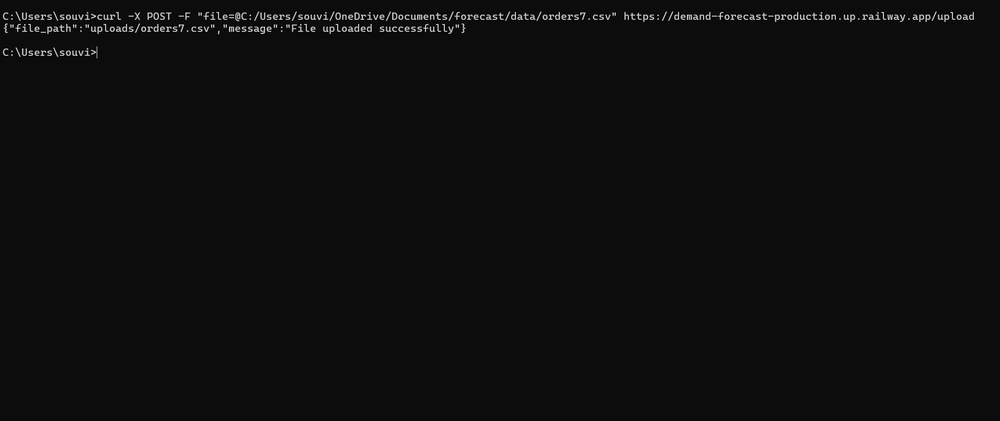
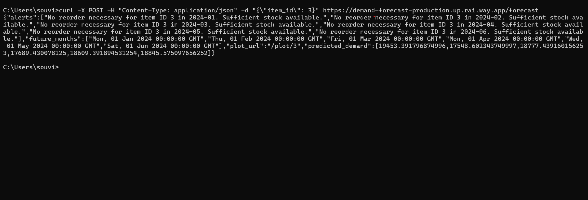
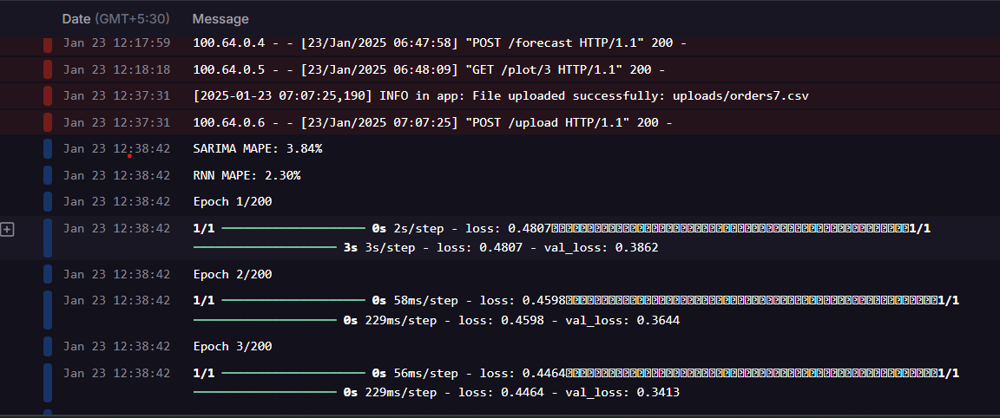
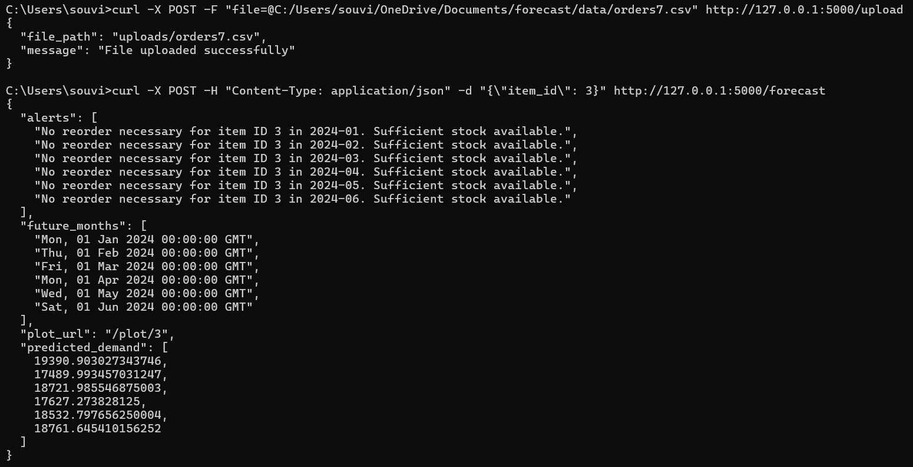

<p align="center">
<a href="https://dscvit.com">
	
</a>
	<h2 align="center"> < Insert Project Title Here > </h2>
	<h4 align="center"> < Insert Project Description Here > </h4>
</p>

---
[](https://dsc.community.dev/vellore-institute-of-technology/)
[](https://discord.gg/498KVdSKWR)

[](INSERT_LINK_FOR_DOCS_HERE) 
[](INSERT_UI_LINK_HERE)

---

## Preview
Here are some images related to the project:

<p align="center">
	
	
	
	
	
	
	
	
	
	
</p>

---

## Features
- [x]  curl -X POST http://127.0.0.1:5000/extract -H "Content-Type: application/json" -d "{\"text\": \"John Doe bought 2 apples for $5\"}"

```json
{"CustomerName":"John Doe","ItemName":"apples","ItemQuantity":"2","Price":"5"}
```

- [x] curl -X POST "http://127.0.0.1:5000/extract_entities" -H "Content-Type: application/json" -d "{\"text\":\"apples less than 50 rs\"}"

```json
{"action":"less","object":"apples","range":"50"}
```

## Running

### Installation
```bash
docker-compose up --build 
docker-compose up 
```

### Execution
```bash
< insert code >
```

---

## Contributors

<table>
	<tr align="center">
		<td>
		Souvik Mahanta
		<p align="center">
			
		</p>
			<p align="center">
				<a href="https://github.com/souvik03-136">
					
				</a>
				<a href="https://www.linkedin.com/in/souvik-mahanta/">
					
				</a>
			</p>
		</td>
	</tr>
</table>

<p align="center">
	Made with ❤ by <a href="https://dscvit.com">GDSC-VIT</a>
</p>
